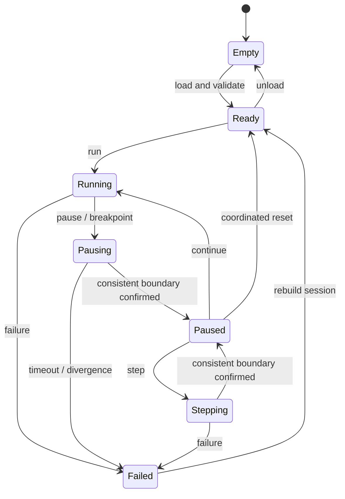

# Debugging and instruments

## Requirement

Preserve STM32CubeIDE connectivity to the virtual MCU through GDB. Renode documents a GDB server and common debugging operations; this alone does not validate a particular CubeIDE version with the entire co-simulation. [Official documentation](https://renode.readthedocs.io/en/latest/debugging/gdb.html).

Start with one single-core MCU, ELF debug symbols, and local GDB. Create a CubeIDE launch recipe after testing the installed version. Do not assume menu names or compatibility with ST-LINK/OpenOCD scripts.

## Proposed state machine

Reset while running first requires coordinated stopping. A debugger-triggered MCU reset must be observed/intercepted and translated into a session reset or explicitly rejected. Do not restart firmware while leaving the analog state at an unrelated time.

## Coordinated pause

Renode distinguishes a pause that blocks a time domain from `IsHalted` behavior that may let other members advance. Do not treat one boolean as a universal pause contract. SimNodus must propagate debugger stops to ngspice and verify the result. [Time framework](https://renode.readthedocs.io/en/latest/advanced/time_framework.html).

Observe the effective stop time and whether another engine already passed it. If consistency cannot be preserved, report a limitation/error rather than a fictitious synchronized pause. Wall-clock timeouts detect communication failures; they never advance simulation time.

Instruction step and simulation-interval step are different operations. Step-over can execute many instructions; the circuit must follow the entire interval. Do not let GDB and the scheduler independently grant time. E-05 selects the arbitration strategy.

## Instruments

First export CSV voltage, oriented branch current, GPIO, and UART logs with units, entity IDs, and virtual time. Later provide graphical oscilloscope, logic analyzer, and UART terminal. Visual downsampling must not discard events needed by the kernel or original report.

Diagnostics include code, severity, time, entities, explanation, and model limits. Overcurrent warnings require documented parameters and do not certify physical safety.

Future inspection connects node, terminal, alternate function, peripheral, and register. Show unavailable data explicitly. Whole-circuit reverse debugging is outside the MVP: restoring the MCU alone does not restore solver history or queued events.

Control/debug servers should bind only to loopback by default, with configurable ports. Verify the chosen Renode version's actual bind behavior; do not assume GDB authentication.
