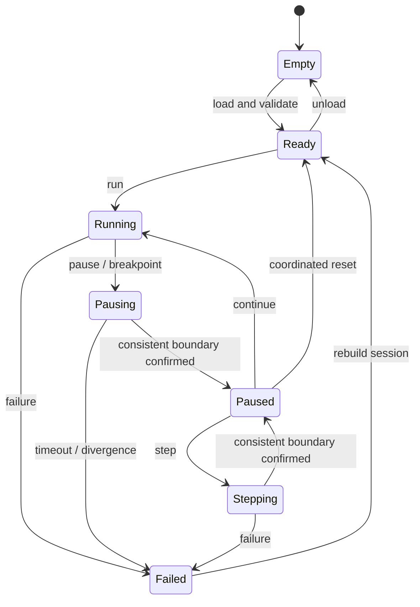

# Debugging and instruments

## Requirement

IDEs and toolchains remain external under the
[MCU independence boundary](README.md#mcu-and-toolchain-independence).
Prefer compatible ELF firmware and GDB debug interfaces where supported;
the initial CubeIDE recipe does not make CubeIDE part of the core or imply
that all future devices expose identical loading/debug capabilities.

Preserve STM32CubeIDE connectivity to the virtual MCU through GDB. Renode documents a GDB server and common debugging operations; this alone does not validate a particular CubeIDE version with the entire co-simulation. [Official documentation](https://renode.readthedocs.io/en/latest/debugging/gdb.html).

Start with one single-core MCU, ELF debug symbols, and local GDB. Create a CubeIDE launch recipe after testing the installed version. Do not assume menu names or compatibility with ST-LINK/OpenOCD scripts.

## Proposed state machine



Reset while running first requires coordinated stopping. A debugger-triggered MCU reset must be observed/intercepted and translated into a session reset or explicitly rejected. Do not restart firmware while leaving the analog state at an unrelated time.

## Coordinated pause

Renode distinguishes a pause that blocks a time domain from `IsHalted` behavior that may let other members advance. Do not treat one boolean as a universal pause contract. SimNodus must propagate debugger stops to ngspice and verify the result. [Time framework](https://renode.readthedocs.io/en/latest/advanced/time_framework.html).

Observe the effective stop time and whether another engine already passed it. If consistency cannot be preserved, report a limitation/error rather than a fictitious synchronized pause. Wall-clock timeouts detect communication failures; they never advance simulation time.

Instruction step and simulation-interval step are different operations. Step-over can execute many instructions; the circuit must follow the entire interval. Do not let GDB and the scheduler independently grant time. E-05 selects the arbitration strategy.

## Measured experimental profile

E-05's bounded single-CPU profile is accepted in
[ADR 0014](../decisions/0014-bounded-cooperative-debugging.md). It requires the
measured cooperative backend extension, protected GDB endpoint, persistent RC
checkpoint checks and explicit pacing constraints. CPU cancellation is not a
joint commit. Reset is full recreation; active disconnect and backend failure
abort the session. General unpaced debugging remains unapproved. SN-017 may
extract these contracts into a small headless runner; no production kernel or
Qt application is implemented by the experiment result.

## Instruments

Status: accepted architectural direction under [ADR 0027](../decisions/0027-shared-instrumentation.md); shared stores, graphical instruments, and decoder services are not implemented. Names below are conceptual, not fixed classes or APIs.

First export CSV voltage, oriented branch current, GPIO, and UART logs with units, entity IDs, and virtual time. Later provide graphical instruments and a UART terminal. Probe Inspector, instantaneous node views, plots, Oscilloscope, Logic Analyzer, and Protocol Decoders belong to one architecture with shared acquisition, storage, and distribution.

### Shared observation flow

The [desktop UX design](DESKTOP_UX.md) under
[ADR 0049](../decisions/0049-desktop-ux-and-measurements.md) maps this infrastructure
to independent Circuit Editor and Signal Analyzer windows. Contextual probes,
schematic meters, tooltips and analyzer channels share measurement definitions
with stable entity/instance IDs and explicit quantity/reference/orientation.
Renames do not break associations; unresolved targets must not rebind by label.
The analyzer owns view state, not primary captures. Closing a view preserves
retained session data within the storage limits below. "Digital Event Store"
in the UX document means the existing Event Store; its conceptual Analysis API
is the shared analysis/distribution boundary, not a second instrumentation stack.

```text
ngspice adapter ----+
Renode adapter -----+--> kernel-coordinated acquisition / Simulation Timeline
digital sources ----+                        |
                          +------------------+------------------+
                          |                                     |
                    Analog samples                        Digital transitions
                          |                                     |
                     Signal Store                           Event Store
                          |                                     |
                +---------+---------+                 +---------+---------+
                |                   |                 |                   |
          Oscilloscope        Probes / plots     Logic Analyzer     DecoderManager
                                                                          |
                                                   +----------------------+------------------+
                                                   |                      |                  |
                                             Native decoder        Python decoder     Sigrok adapter
```

Arrows describe data relationships, not threads or timing guarantees. Probes and plots may consume either store; decoder annotations return through shared distribution to instruments and exports. MCU and peripheral observations use the same timeline and source mappings. Digital sources do not imply a new digital engine; the XSPICE-first direction remains in force.

Simulation Timeline means the kernel-owned virtual time in [time and causality](SIMULATION_TIME.md), not a new clock or scheduler. Preserve checked 1 ns orchestration time, actual backend resolution, conversion tolerances, stable same-time ordering, and session identity across resets. Distinguish observation time, effective time, and joint committed time where they differ. Host arrival time and GUI refresh do not establish signal time or accuracy.

Adapters supply observations through kernel coordination. Accepted analog callbacks alone are not joint commits; trial solver points must not become normal traces. Normal views, exports, and decoding consume committed records. Tentative previews must be separate and labeled. Preserve approximate-mode labels under the [temporal capability profile](TEMPORAL_CAPABILITY_PROFILE.md): storing events cannot recover missed pulses, undo collapsed transitions, or establish unsupported causality.

### Signal and event records

Analog data is conceptually timestamped samples with signal identity, quantity, unit, and provenance. Preserve voltage references and branch-current orientation. Signal Store feeds probes, plots, scope views, and measurements independently of display refresh. Sampling policy, interpolation, buffer layout, and storage implementation remain open; timestamps do not imply uniform sampling.

Prefer digital state transitions over periodic Boolean sampling. A conceptual transition carries time, signal identity, and resulting state. Retain a known initial state, or explicit unknown state, to interpret intervals before the first transition. Sparse transitions reduce storage for unchanged signals, preserve available event-time resolution, and serve logic views and protocol decoding. They do not promise a compression ratio or timing finer than the source provides.

Concrete digital-state types remain open. A Boolean edge illustration must not erase the [electrical boundary](BACKEND_CONTRACTS.md) distinction between drive and sense, high impedance, undefined levels, and conflicts. Preserve component, pin, net, and subcircuit instance mappings; two instances must not share a signal identity merely because they use one definition.

Bound memory and distribution queues. Display downsampling must not discard events needed by the kernel, decoders, or original report. Retention, overflow handling, capture limits, and persistence remain future design work; unavailable or truncated intervals must be explicit. Stored observations remain results rather than editable circuit sources under [project persistence](PROJECT_FORMAT.md).

### Instruments and decoders

Oscilloscope, Logic Analyzer, and Probe Inspector consume shared records and immutable snapshots rather than calling ngspice or Renode directly. Acquisition and decoding operate without Qt. The future integrated logic analyzer is conceptually similar to PulseView: multiple MCU pins, circuit nets, or digital component outputs on one timeline, with zoom, temporal navigation, cursors, measurements, and decoder annotations. This is product direction, not a GUI library selection or implemented capability.

Protocol interpretation belongs outside the GUI. A provisional DecoderManager consumes digital events and distributes implementation-independent results. Conceptually, an annotation contains start/end time, row or channel, text, and kind, with source provenance. Types, streaming/batch interfaces, lifecycle, and extension ABI remain undecided. The GUI presents annotations without knowing protocol internals. Decoders observe; they do not grant simulation time or drive inputs.

| Future decoder path | Direction and limits |
|---|---|
| Native C++ | Suggested order: PWM/frequency/duty-cycle analysis, UART, I2C, then SPI. This is a priority proposal, not validated protocol or peripheral support. |
| Python | Keep an optional route for experiments, academic work, custom protocols, teaching, and user extensions. No runtime or execution model is selected or implemented. |
| Sigrok adapter | Keep possible future `libsigrokdecode` reuse behind an optional adapter. Internal signal/event/annotation contracts must not depend on sigrok types or availability. No integration is selected or implemented. |

CAN, 1-Wire, Modbus RTU, and other protocols remain later candidates. Before direct `libsigrokdecode` integration, review the exact dependency's license, integration approach, and distribution obligations under the [licensing policy](../development/LICENSING.md). No compatibility or redistribution permission is assumed. Future decoder extensions require an explicit execution and trust policy: opening a circuit must not execute decoder code, download dependencies, or load native libraries automatically.

### Circuit and firmware correlation

Shared signal/event infrastructure is independent of MCU family. STM32, future
ESP32/AVR devices, and other validated platforms feed the same acquisition and
distribution boundary through their adapters. Probes, Oscilloscope, Logic
Analyzer, and Protocol Decoders consume common identities, records, and
capability metadata rather than assuming STM32 pins or registers. Family-specific
inspection may supply additional fields without making them mandatory for every
MCU. This preserves extensibility without claiming support for any new device.

Preserve future correlation of electrical signals with MCU configuration and firmware activity. An inspector could associate PA8 with its net, voltage, alternate function, TIM1_CH1, measured PWM frequency/duty cycle, and a timestamped TIM1 register observation. A SPI view could compare configured clock/CPOL/CPHA with observed clock and decoded TX/RX bytes. These are illustrative relationships, not claims that the tested STM32 profile exposes these fields.

Distinguish configured, observed, and derived values with timestamps and provenance. A current register snapshot does not prove a historical firmware write; source-level attribution needs separate symbol/trace evidence. Missing routing, register, electrical, or protocol information must be unavailable rather than inferred from a generic peripheral model. Adapter capabilities and validated device profiles determine possible correlations.

### Diagnostics and retained limits

Diagnostics include code, severity, time, entities, explanation, and model limits. Overcurrent warnings require documented parameters and do not certify physical safety.

Future inspection connects node, terminal, alternate function, peripheral, and register. Show unavailable data explicitly. Whole-circuit reverse debugging is outside the MVP: restoring the MCU alone does not restore solver history or queued events.

Control/debug servers should bind only to loopback by default, with configurable ports. Verify the chosen Renode version's actual bind behavior; do not assume GDB authentication.
