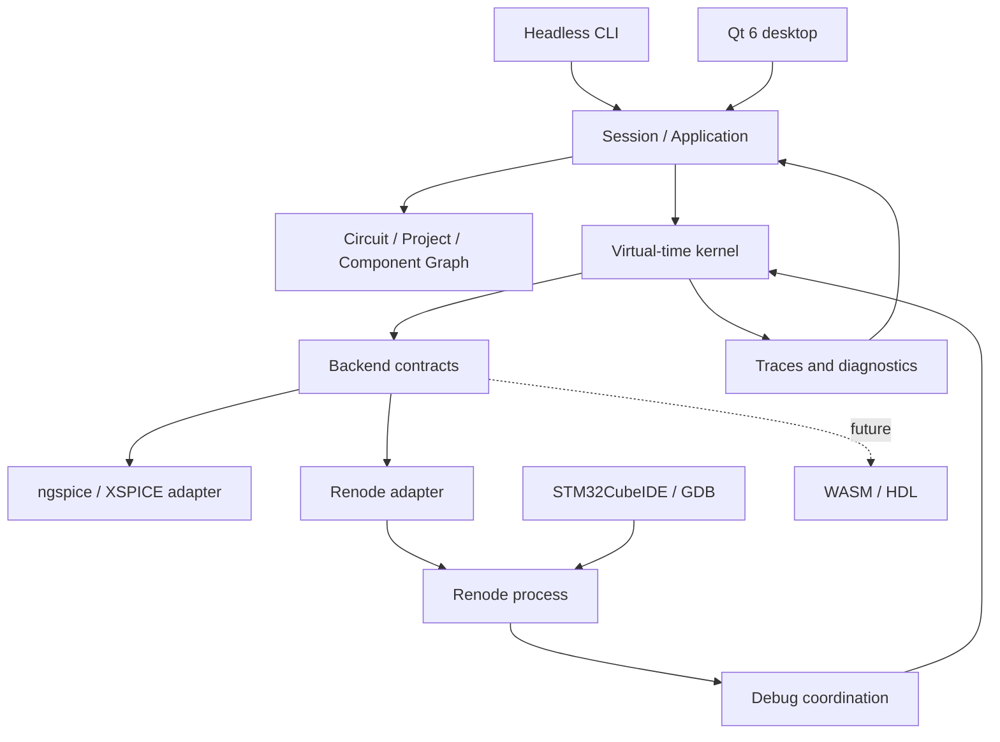

# Initial architecture

Status: design baseline, not implementation. Product direction and experimental implementation proposals are distinguished in [ADRs](../decisions/README.md).

## Module overview

Arrows show architectural relationships, not implemented threads or transport guarantees.

| Future module | Responsibility | Must not do |
|---|---|---|
| `domain` | IDs, components, pins, nets, hierarchy, parameters, project | Call Qt or simulation engines |
| `core` | Time, event scheduling, states, causality, coordination | Draw UI or interpret STM32 registers |
| `adapters/ngspice` | C API, netlist, external sources, samples, solver errors | Invent unsupported temporal controls |
| `adapters/renode` | Process lifecycle, platform, firmware, I/O | Infer full STM32 support from model presence |
| `coupling` | Translate drive, voltage, logic, and ADC sampling | Treat GPIO as a universal ideal voltage source |
| `application` | Project loading, session preparation, commands, persistence | Own a second simulation timeline |
| `instrumentation` | Traces, exports, diagnostics, correlation | Derive causality from GUI refresh |
| `apps/cli` | Reproducible headless experiments | Substitute fake backends for integration evidence |
| `apps/desktop` | Qt editor and instruments | Run the solver on the GUI thread |

These are planned destinations under [src](../../src/README.md), not existing libraries.

## Process and execution boundaries

For M1/M2, a C++ console host loads one ngspice shared-library instance and controls a separate Renode process through an adapter. Evaluate the selected version's official external-control API before inventing a protocol.

The kernel owns session state. Backend callbacks neither mutate the editable document nor call the GUI. UI commands are queued and receive an effective timestamp upon acceptance. The GUI reads immutable snapshots and committed traces. Bound memory usage; reduce display samples without losing kernel events.

A native library can crash its host. A separate simulation worker is the proposed M3 direction if experiments justify it, preserving the contracts. Process isolation alone is not a security sandbox.

## Session flow

1. Validate project, dependencies, versions, IDs, and pin mappings.
2. Resolve hierarchy into a simulation representation while retaining source mappings.
3. Partition models between backends and create electrical/digital boundary couplers.
4. Initialize engines paused; load ELF and electrical initial state.
5. Negotiate actual temporal capabilities and select a supported mode.
6. Run, observe, and debug without publishing tentative states as committed results.
7. Stop and release resources, preserving the document and failure report.

## Scope controls

The SPICE netlist is generated from the circuit graph, not the master project format. Start digital modeling with XSPICE; build another digital engine only for a demonstrated need. A future HDL instance must have one integration path and one time owner, avoiding duplicate coordination through Renode and ngspice. WASM is outside the minimal kernel.

Qt Widgets versus Qt Quick, plotting implementation, worker IPC, and a dependency manager remain open. None is required for the first backend experiments.

## Detailed contracts

- [Time and causality](SIMULATION_TIME.md).
- [Temporal capability profile](TEMPORAL_CAPABILITY_PROFILE.md).
- [Backend and electrical coupling](BACKEND_CONTRACTS.md).
- [Components and hierarchy](COMPONENTS.md).
- [Persistence](PROJECT_FORMAT.md).
- [Debugging](DEBUGGING.md).
