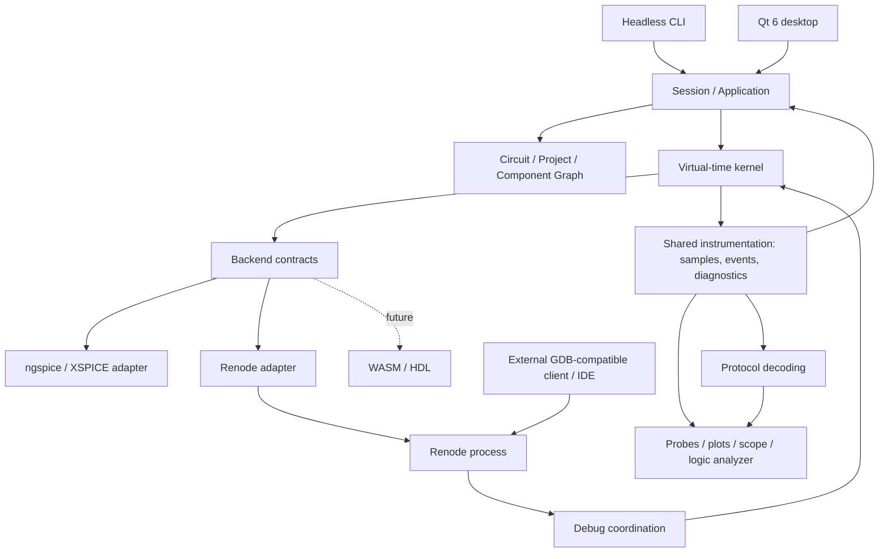

# Initial architecture

Status: design baseline, not implementation. Product direction and experimental implementation proposals are distinguished in [ADRs](../decisions/README.md).

## Module overview

Arrows show architectural relationships, not implemented threads or transport guarantees.

| Future module | Responsibility | Must not do |
|---|---|---|
| `domain` | IDs, components, pins, nets, hierarchy, parameters, project | Call Qt or simulation engines |
| `core` | Time, event scheduling, states, causality, coordination | Draw UI or interpret device-specific registers |
| `adapters/ngspice` | C API, netlist, external sources, samples, solver errors | Invent unsupported temporal controls |
| `adapters/renode` | Process lifecycle, platform, firmware, I/O | Infer full MCU support from model presence |
| `coupling` | Translate drive, voltage, logic, and ADC sampling | Treat GPIO as a universal ideal voltage source |
| `application` | Project loading, session preparation, commands, persistence | Own a second simulation timeline |
| `instrumentation` | Shared acquisition, signal/event stores, distribution, decoding, exports, diagnostics, correlation | Own simulation time or depend on GUI/backend-specific types |
| `apps/cli` | Reproducible headless experiments | Substitute fake backends for integration evidence |
| `apps/desktop` | Qt editor and instruments | Run the solver on the GUI thread |

These are module destinations under [src](../../src/README.md). SN-017 has
[accepted the bounded headless composition](../experiments/SN-017-acceptance.md):
native contracts, adapters, supervision and application session, with explicit
Python/C# fixture scheduling and GDB transport. The complete module design and
production application remain proposed.

## Process and execution boundaries

### MCU and toolchain independence

STM32F103C8/Blue Pill remains the initial reference platform and MVP focus, not
an architectural limit. [ADR 0028](../decisions/0028-mcu-platform-independence.md)
preserves future ESP32, AVR, other STM32 families, and other devices through
appropriate emulation backends. These are candidates, not support claims.

The conceptual boundary is `SimNodus core -> MCU abstraction -> emulation adapter
-> selected platform`. Renode is a backend for multiple platforms, not an
STM32-specific domain component; another suitable backend may serve a future
device. This does not select concrete interfaces or require a new abstraction
layer now. Each backend must satisfy the declared temporal and electrical
contracts; a new MCU does not bypass existing causality restrictions.

Use family-neutral concepts such as `McuBackend`, `McuPin`, `FirmwareImage`, and
`McuInstance` for generic responsibilities. Names such as `STM32F103Platform`,
`ESP32Platform`, and `RenodeBackend` remain appropriate for genuinely specific
platforms or adapters. These are naming examples, not classes to implement.
Device registers, memory maps, pin routing, boot requirements, and peripheral
details belong in platform descriptions and adapters rather than the core.

STM32CubeIDE, ESP-IDF, VS Code, and other IDEs/toolchains are external tools.
They produce firmware and may access compatible debug mechanisms; none is an
internal core dependency. Prefer generic firmware formats such as ELF and
GDB-compatible debug interfaces where the selected platform/backend supports
them. Loading and debugging still require a compatible image, architecture,
platform configuration, and verified backend capabilities; ELF or GDB alone
does not establish device support. The initial CubeIDE workflow remains a
product integration requirement, not a core architecture dependency.

Effective support depends on the availability, coverage, and maturity of CPU
and peripheral models in the selected backend, including Renode. Validate the
exact device/profile, firmware execution, I/O, timing, and debugging needed by
the intended lessons. A CPU model or generic peripheral is insufficient evidence
of board support. ESP32, AVR, and additional platforms remain future work; no
support for them is implemented or validated by this decision.

For M1/M2, a C++ console host loads one ngspice shared-library instance and controls a separate Renode process through an adapter. Evaluate the selected version's official external-control API before inventing a protocol.

The kernel owns session state. Backend callbacks neither mutate the editable document nor call the GUI. UI commands are queued and receive an effective timestamp upon acceptance. The GUI reads immutable snapshots and committed traces. Bound memory usage; reduce display samples without losing kernel events.

A native library can crash its host. A separate simulation worker is the proposed M3 direction if experiments justify it, preserving the contracts. Process isolation alone is not a security sandbox.

## Session flow

1. Validate project, dependencies, versions, IDs, and pin mappings.
2. Resolve hierarchy into a simulation representation while retaining source mappings.
3. Partition models between backends and create electrical/digital boundary couplers.
4. Initialize engines paused; load ELF and electrical initial state.
5. Negotiate actual temporal capabilities and select a supported mode.
6. Run, observe, and debug without publishing tentative states as committed results.
7. Stop and release resources, preserving the document and failure report.

## Scope controls

The SPICE netlist is generated from the circuit graph, not the master project format. Start digital modeling with XSPICE; build another digital engine only for a demonstrated need. A future HDL instance must have one integration path and one time owner, avoiding duplicate coordination through Renode and ngspice. WASM is outside the minimal kernel.

Qt Widgets versus Qt Quick, plotting implementation, worker IPC, and a dependency manager remain open. None is required for the first backend experiments.

[Desktop UX](DESKTOP_UX.md) defines independent Circuit Editor and Signal Analyzer
windows over the same session/instrumentation under
[ADR 0049](../decisions/0049-desktop-ux-and-measurements.md). Its desktop panel,
multi-monitor and persistence requirements inform the open Qt evaluation; they
do not select Widgets or Quick. Detailed analysis and primary capture storage
remain separate responsibilities.

## Detailed contracts

- [Desktop UX and visual instrumentation](DESKTOP_UX.md).

- [Time and causality](SIMULATION_TIME.md).
- [Temporal capability profile](TEMPORAL_CAPABILITY_PROFILE.md).
- [Backend and electrical coupling](BACKEND_CONTRACTS.md).
- [Components and hierarchy](COMPONENTS.md).
- [Persistence](PROJECT_FORMAT.md).
- [Bounded local resource snapshots](LOCAL_RESOURCE_VERIFICATION.md).
- [Debugging and shared instrumentation](DEBUGGING.md), with the accepted [instrumentation decision](../decisions/0027-shared-instrumentation.md).
