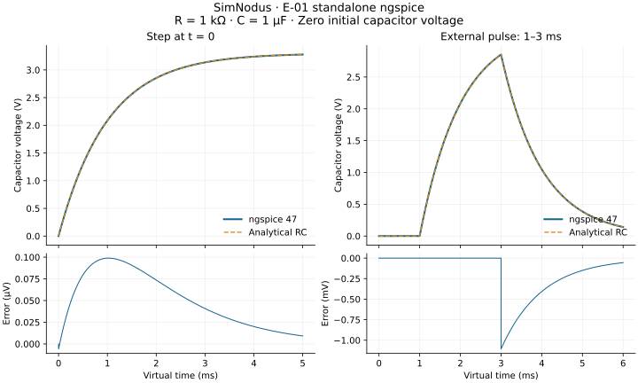

# E-01: Standalone ngspice results

Date: 2026-08-31. Task: [SN-011 / #2](https://github.com/RicardoKers/SimNodus/issues/2). **Passed for the bounded standalone Windows profile below.** No Renode, firmware, coupled feedback, or debugger behavior is validated by this result.

## Question and predeclared criteria

Can a native host run the selected ngspice DLL, exchange external-source values and samples, pause/resume, and recover a usable initial state?

The [experiment specification](../../tests/experiments/ngspice/README.md) was written before the first circuit run. The reference is an ideal 1 kOhm / 1 uF RC with zero initial capacitor voltage, driven by 3.3 V. The maximum allowed voltage error is **16.5 mV**, or 0.5% full scale. Final-time tolerance is **1 ps**. Reset/repeat comparisons use 1 ps and 1 nV. Only the external pulse's 2 us edge neighborhoods are excluded from its primary error gate; inclusive error is reported too.

The ideal step response is `3.3 * (1 - exp(-t / 0.001))`. For the external pulse, subtract the step response starting at 3 ms from the one starting at 1 ms. UIC initializes the capacitor without a DC operating-point solve. The first returned sample is at 10 ns, not at zero.

## Environment and provenance

- Windows 11 x64, MSVC 19.51.36246.0, Windows SDK 10.0.26100.0, CMake 4.2.3-msvc3, Python 3.14.4. Native host: C++20 Debug, `/W4 /WX /permissive-`.
- Unchanged ngspice 47 DLL, shared header, libsndfile 1.2.2, libsamplerate 0.2.2, and bundled OpenMP runtime from [SN-010](SN-010-results.md). [Package and file hashes](../../tools/backend-baseline.json) were checked before execution.
- Actual circuit runs reported **SPARSE 1.3**, not KLU, as the selected linear solver. Temperature/TNOM: 27 C. Netlist options: `reltol=1e-6`, `abstol=1e-12`, `vntol=1e-9`, trapezoidal integration, maximum order 2, maximum step 1 us.
- Owned netlists and host code only. No `.include`, `.control`, third-party model, XSPICE code model, OSDI module, or firmware was loaded. No firmware/ELF hash applies.
- [Machine-readable evidence](evidence/E-01-summary.json) contains three complete local runs, source/netlist/header-helper/executable fingerprints, metrics, and numerical comparisons. The executable hash identifies that local build; it is not a promise of identical binaries on another compiler/path.
- Original experiment code/fixtures/results use MIT. Upstream binaries remain external dependencies with the [recorded licensing restrictions](../research/DEPENDENCIES.md).

## Reproduction

Follow [the experiment commands](../../tests/experiments/ngspice/README.md). The runner starts each case in a fresh process with a 30-second wall-time limit, writes raw CSV/logs under the chosen build directory, and independently checks the analytical reference in Python. Core execution and analysis need no Python packages. Optional plotting uses matplotlib.

The separate [Windows experiment workflow](../../.github/workflows/ngspice.yml) downloads only the three pinned ngspice archives, verifies them, builds the native host, runs all eight cases, and repeats the deterministic comparisons. It does not change the root CMake configuration or imply Linux simulation support. Hosted results are available in [workflow runs](https://github.com/RicardoKers/SimNodus/actions/workflows/ngspice.yml); this committed evidence file records the local runs.

The first [hosted E-01 run, 33406697838](https://github.com/RicardoKers/SimNodus/actions/runs/33406697838), passed both complete suites on Windows Server 2025, image `windows-2025-vs2026` revision `20260824.214.3`, with MSVC 19.51.36256.0. Its RC and external-pulse errors matched the local values above; its own deterministic repeats passed. This is independent Windows execution evidence, not a clean classroom-machine packaging test.

## Observations

All **eight cases passed in three independent local runs** (24 child processes). Every copied data callback matched the corresponding stored vector exactly, including resumed runs and the three reset segments. The seven foreground cases repeated within the declared 1 ps / 1 nV bounds. Background pause location is deliberately not treated as deterministic.

| Case | Measured result | Interpretation |
|---|---|---|
| Step at zero | 5,012 points through 5 ms; maximum error 0.0989 uV | Analytical RC reference passed |
| External pulse | 6,112 points through 6 ms; error 1.1026 mV outside edge windows, 1.1054 mV including them | External voltage requests and both discontinuities exercised |
| Integration breakpoint | An accepted sample exactly at 2 ms; execution still reached 5 ms | `ngSpice_SetBkpt` creates an integration boundary; it does not pause the host |
| Foreground pause/resume | Requested condition `time > 0.002`; paused at 2.0001 ms; resumed through 5 ms | Observed 100 ns threshold overshoot, within the predeclared bound |
| Background pause/resume | Pause before 50 ms completion, then successful resume through 50 ms | Request and confirmed pause are distinct; actual worker termination was checked before DLL unload |
| Circuit/full reset | Circuit `reset`/`run`, then `ngSpice_Reset`/reinitialize/reload/run | Both returned the same RC time/input/output vectors within the strict repeat gate |
| Invalid netlist/recovery | Missing diode model diagnosed; no transient vector/callback samples; full reset followed by successful RC run | Error detection and recovery worked for this specific invalid input |
| Explicit solver retry | One retry requested at about 1.2346596 ms; rejected candidate absent from accepted output; error 1.5138 mV | Local trial rejection worked; this is not rollback of committed multi-engine state |

In the three recorded background runs, the last observed time before requesting a halt was approximately 0.988774 ms, and the actual pause was 1 us later. Measured halt/join wall time was approximately 110–114 ms. This is an observation of an instrumented local host, not a guaranteed latency or virtual-time bound. Source inspection shows a 100 ms Windows polling interval in the selected `_thread_stop` implementation.

## API findings that constrain future adapters

1. **Callbacks have prerequisites.** A non-null `SendData` with a null `SendInitData` receives no sample callbacks in this binary. The initial measurement host read correct final vectors but missed callbacks; it was corrected to register both, and the final checks reject missing callbacks. Foreground data/source callbacks ran on the calling thread; background data callbacks ran on the worker thread.
2. **Trial time can repeat or move backward.** The external case made 12,263 source requests for 6,112 accepted points, including 19 decreasing-time queries and 19 solver retry notifications. The explicit-retry case made 12,265 requests with 20 reversals. External sources must be functions of the requested trial time, without irreversible actions based on query arrival.
3. **Accepted output is a distinct stream.** In the pinned source, `dctran.c` calls `CKTdump` at accepted time points; the shared output path calls `SendData`. `GetSyncData` locations 0 and 1 participate in timestep selection/retry, not a universal commit notification. Copied callbacks matched final accepted vectors in every tested case. That says nothing about an MCU's committed state.
4. **A stop request is not an exact stop.** Integration breakpoints and pause conditions have different behavior. Do not implement `advance_until(T)` by calling `ngSpice_SetBkpt(T)` and claiming the engine stopped. The measured foreground threshold and asynchronous background stop need different capability descriptions.
5. **The background flag is misleadingly documented.** This release emits `false` at worker start and `true` at completion (`fl_exited` in source), contrary to a header comment describing a running flag. Both pause/resume cycles emitted `[0, 1, 0, 1]`. The host opens a synchronization handle to its own callback thread and waits for termination before freeing the DLL; notification alone is not the resource-release barrier.
6. **Return zero is insufficient error evidence.** Both loading and attempting to run the invalid circuit returned zero while emitting errors, with no transient vector. There was no controlled-exit callback for that parse failure. Future diagnostics must account for the selected backend's error stream and expected outputs. Normal `quit` still returns 1 with controlled-exit status 0.
7. **Reset invalidates state.** Full library reset is followed by `ngSpice_Init`, callback registration, circuit reload, and fresh vector copies. No borrowed pointer is retained across those operations. The known pre-init-call crash from SN-010 was not repaired or approved: the successful route still uses the owned `spinit` with `set no_spiceinit`.

These conclusions combine execution with inspection of the exact release archive: `src/sharedspice.c`, `src/spicelib/analysis/dctran.c`, `src/frontend/outitf.c`, and `src/include/ngspice/sharedspice.h`. Use the pinned source, not newer API documentation or example parameter names.

## Checks and limitations

The independent analyzer also rejected deliberately corrupted copies of evidence: a 100 mV voltage error, a nonfinite value, a repeated timestamp, and an incorrect final time. The earlier SN-010 probe still compiled and passed after its Windows loading/configuration helpers were shared with E-01.

There is no production adapter or scheduler yet. Only ideal linear RC circuits and a voltage-source callback were exercised. Current-source callbacks, nonlinear convergence failures, XSPICE digital events, multiple DLL instances, arbitrary callback reentrancy, long-duration memory/handle leak behavior, forced backend crashes/timeouts, and Linux runtime behavior remain untested. Guards and timeouts are defensive measures, not proof of every failure path. No engine control commands are issued from callbacks.

## Decision and next step

Complete SN-011 and retain the recorded restrictions in [ADR 0007](../decisions/0007-ngspice-experiment-contract.md). Next, execute [SN-019 / #11](https://github.com/RicardoKers/SimNodus/issues/11) to make the pinned Renode external client usable on native Windows, then E-02. The joint temporal capability profile, causal feedback, ADC, and coordinated debugging remain gated by their own experiments.
