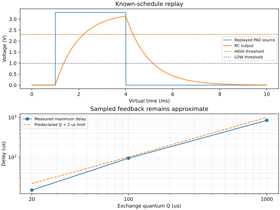

# E-03 result: GPIO/RC coupling and sampled feedback

Date: 2026-08-31. Task: [SN-014 / #5](https://github.com/RicardoKers/SimNodus/issues/5). Result: **passed for known-schedule replay and the bounded sampled approximation below. General live causal feedback remains unsupported.** This is real coupled-backend evidence, not a production scheduler, full electrical GPIO model, or proof for arbitrary firmware and circuits.

## Question and decision

Can the pinned Renode and ngspice engines exchange GPIO/electrical signals without hiding late input? The experiment establishes two different answers:

- **Yes for known-schedule replay.** Actual PA0 callbacks were recorded before ngspice advanced. The RC run met its numerical and crossing gates and both engines ended at an exact 10 ms boundary.
- **Only as an approximation for live sampled exchange.** PA0 drove the RC, the accepted Schmitt crossing drove PA1/EXTI1, and firmware acknowledged it on PA4. Every standard crossing was applied after Renode had passed its effective time. Reducing `Q` reduced delay but did not change that causal fact.

Adopt the deliberately restricted profile in [ADR 0011](../decisions/0011-e03-restricted-feedback.md): retain P0 replay, allow P1 only with an explicit sampled/approximate label and measured bounds, and keep general P2 live causal feedback unsupported. A focused Renode extension is deferred until a lesson or later experiment requires it; it is not disguised by a smaller quantum.

## Predeclared contract

The [SN-013 temporal profile](../architecture/TEMPORAL_CAPABILITY_PROFILE.md) fixed these gates before execution:

- ideal 3.3 V, 1 kOhm / 1 uF RC with 1 us maximum ngspice step;
- rising threshold 2.31 V, falling threshold 0.99 V, and retained state between them;
- maximum voltage error 16.5 mV outside 2 us source-edge windows;
- maximum threshold-crossing error 2 us;
- sampled quanta `Q = 1000 us`, `100 us`, and `20 us`, with application delay at most `Q + 2 us`;
- three fresh repetitions, `T-1 us` / `T` / `T+1 us` cases, short/distinct and equal-time inputs, late-input rejection, and failure before commit.

No tolerance was changed after observing results.

## Environment and inputs

- Windows 11 `10.0.26200`, x64; Python 3.14.4; CMake 4.2.3-msvc3; MSVC 19.51.36246.0, C++20 Debug with `/W4 /WX /permissive-`.
- Renode `1.16.1.19220`, commit `d66b0c2aa3d420408eccecfd1d3bab0fd702a6db`, and SN-019's source-pinned native client plus verified loopback-only server.
- ngspice 47 DLL and E-01's checked initialization route. The circuit reported SPARSE 1.3, 27 C, `reltol=1e-6`, `abstol=1e-12`, `vntol=1e-9`, trapezoidal integration, maximum order 2, and maximum step 1 us.
- Arm GNU Tools 14.3.rel1, compiler SHA-256 `c8fcafea64559054bbfa87917182598892f81b41706b003c5a93fa7542355908`.
- Owned firmware ELF SHA-256 `a961e7f283e7a9cbc07cc00cb289653d46bbea3fa6595f6387fad6ede2e4ff01`; two consecutive builds were identical. The offline platform retains exact 64 KiB flash, 20 KiB SRAM, fixed 8 MIPS CPU throughput, fixed 8 MHz SysTick, and RCC register storage from E-02.
- Final local host executable SHA-256 `ccdccfa043b4106cf14e53f592a27883a2fd259841376b1c1001526a187a41d5`.

The dedicated firmware drives PA0 HIGH at its first 1 ms SysTick and LOW at 4 ms. The longer pulse is intentional: a 1 ms HIGH cannot reach the 0.70 VDD threshold through a 1 ms time-constant RC. PA1 receives resolved feedback; EXTI1 records both edges and PA4 acknowledges the state. Sources, build flags, commands, raw CSV fields, and analysis are in the [reproduction directory](../../tests/experiments/coupling/README.md). The committed [compact evidence](evidence/E-03-summary.json) summarizes the final local run; large raw traces remain ignored.

## Execution coverage

The complete run executed **54 isolated cases**. Every case launched a fresh
Renode process and native host; the 39 replay/sampled/boundary cases also loaded a
fresh ngspice DLL instance:

| Group | Cases |
|---|---:|
| Known-schedule replay | 3 |
| Standard sampled profiles | 3 quanta x 3 repetitions = 9 |
| Boundary positions | 3 quanta x 3 positions x 3 repetitions = 27 |
| Digital pulse/equal-time/late-input profiles | 3 quanta x 3 repetitions = 9 |
| Forced termination and fresh recovery | 3 + 3 = 6 |

Every Renode server used a verified `127.0.0.1` listener owned by the expected process. Normal cases exited and removed the listener. All repeated discrete signatures matched within each case. The runner hashes the firmware, host, source, generated loopback extension, and pinned assets before or after use as appropriate.

Every case directory records UTC supervision start/end, monotonic duration, and
native/Renode exit outcomes separately from virtual time. The 54 supervised
cases took 10.223-11.525 seconds each and 579.742 seconds in total in the final
local run. These wall values characterize the run; they are not timing guarantees.

## Replay result

All three replay runs were identical:

| Measurement | Result | Gate |
|---|---:|---:|
| Accepted samples | 10,112 | More than 1,000 |
| Maximum RC voltage error | 1.102650 mV | 16.5 mV |
| Maximum crossing error | 0.352658 us | 2 us |
| Threshold transitions | Rising and falling, once each | Both required |
| Final time | Renode 10,000 us; ngspice 10 ms | Exact common boundary |

The analytical crossings were 2.203972804 ms and 5.152903623 ms. The measured accepted-sample interpolation found 2.203972812 ms and 5.152550966 ms. This validates the known waveform path, numerical reference, threshold policy, and final state for this fixture. It does not validate live feedback.

## Standard sampled result

Each standard run advanced Renode to the exchange boundary first, exposed observed PA0 changes to ngspice, advanced ngspice, then applied ready Schmitt transitions to PA1 at the current Renode time. This is deliberately measurable and deliberately incapable of backdating input.

| Q | Rising delay | Falling delay | Limit | Maximum voltage error | Maximum crossing error |
|---:|---:|---:|---:|---:|---:|
| 1000 us | 795 us | 846 us | 1002 us | 0.641766 mV | 0.205197 us |
| 100 us | 95 us | 46 us | 102 us | 0.641695 mV | 0.205226 us |
| 20 us | 15 us | 6 us | 22 us | 0.641594 mV | 0.205430 us |

Every number repeated in all three fresh runs. Both crossings in every run were late to Renode. Both PA0 source edges were also discovered after ngspice had advanced 100 ns past their nominal integer-us boundary because `stop when time > T` stopped at `T + 100 ns`. The host did not ask ngspice to set an invalid breakpoint in its past and did not retimestamp the edge; it recorded the late discovery. The resulting numerical error stayed within the approximation gate, but that does not restore causality.

Only the final 10 ms boundary was exact in each standard run. The other 9, 99, or 499 exchange boundaries left ngspice 100 ns ahead of the requested integer-us time. Their intermediate states were not reported as exact joint commits.

The rising-to-falling threshold separation was about 2.949 ms, greater than `Q + 2 us` for every tested quantum. Both qualifying crossings reached EXTI, so the no-miss gate passed for this analog pulse.

## Boundary and input cases

The shifted firmware-derived schedule placed the first analytical crossing at 3999 us, 4000 us, and 4001 us. All 27 cases met the 2 us placement gate and repeated their event order.

| Q | T-1 application delay | T application delay | T+1 application delay |
|---:|---:|---:|---:|
| 1000 us | 1 us | 0 us | 999 us |
| 100 us | 1 us | 0 us | 99 us |
| 20 us | 0 us | 19 us | 18 us |

The `Q=20 us`, `T` crossing was measured at 4000.000012 us. Forward conversion placed it at 4001 us, after the 4000 us exchange boundary, so application waited until 4020 us. This is the intended no-backdating behavior and shows why a nominal “exact boundary” is not a universal zero-delay guarantee.

Distinct direct PA1 pulses of 1 us, 5 us, 20 us, `Q-1 us`, `Q`, and `Q+1 us` produced rising and falling EXTI interrupts in every applicable case. Duplicated widths were tested once. This establishes observed Boolean pulse handling for this exact firmware/platform, not an analog qualifying pulse or a hardware minimum width. HIGH then LOW with no virtual-time advance produced one interrupt and final LOW in every run, preserving E-02's collapse finding. Explicit attempts to apply an event at `now - 1 us` were rejected before the backend and produced no firmware interrupt.

## Failure and recovery

For each of three cases, the host connected, booted firmware, recorded the last successful time, marked the point immediately before a long `RunFor`, and the driver terminated the real Renode process. The native client returned its connection-failed error object (numeric code 0 in this generated API; `ERR_NO_ERROR` is -1). No joint commit was emitted. A completely new Renode process then booted and reached an exact 600 us recovery boundary with the loopback listener verified and removed normally.

This checks the experiment supervisor's process-recreation rule. It does not prove cancellation time, partial advancement, recovery of the terminated instance, ngspice process isolation, or production desktop-worker behavior.

## Interpretation and limitations

E-03 passes its declared restricted outcome. It proves real data flow `PA0 -> ngspice RC -> Schmitt boundary -> PA1/EXTI -> PA4` with accepted analog samples, actual firmware, and explicit producer/observation/application times. It also proves why this fixed-order exchange is not a general causal algorithm.

The result is bounded to one ideal linear RC, two voltage thresholds, one deterministic firmware image, Boolean Renode input, three quanta, 10 ms sessions, and the pinned Windows packages. It does not cover nonlinear convergence, XSPICE, multiple MCUs, electrical drive strength, undefined voltage, open-drain/pulls, ADC, instruction-accurate GPIO timestamps, rollback, lookahead, synchronous joint pause, arbitrary zero-delay loops, long-duration resource behavior, Linux runtime, or GDB/CubeIDE control.

No focused extension is implemented now. E-04 may use replay or the labelled sampled approximation for ADC-path investigation, but it must not claim general feedback causality. E-05 must still resolve debugger ownership and consistent stopping. Production extraction remains gated by both.
