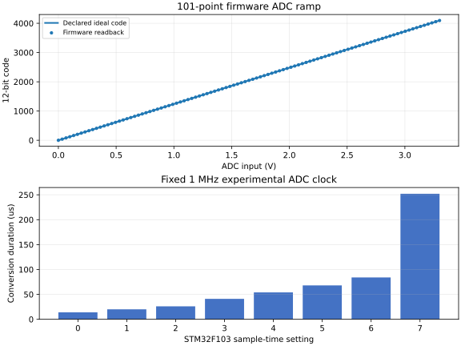

# E-04 result: focused STM32F103 ADC voltage path

Date: 2026-09-01. Task: [SN-015 / #6](https://github.com/RicardoKers/SimNodus/issues/6). Result: **passed for the focused owned ADC experiment profile below.** The result validates one idealized voltage-to-firmware path. It does not validate a production adapter, complete STM32F103 ADC behavior, electrical acquisition, or live ngspice coupling.

## Question and decision

Can a voltage reach owned STM32F103 firmware through a register-compatible ADC model with explicit units, quantization, timing, saturation, and sampling semantics?

Yes, within the declared profile. Three fresh Renode processes completed the same 121 accepted conversions each: 112 firmware readbacks and nine direct timing/sample cases. All 363 results were deterministic. Static points, code boundaries, two channel mappings, and a 101-point ramp matched the predeclared quantization exactly. Every sampling-time setting completed at its declared virtual time, and an in-flight conversion retained the voltage present at software start.

The pinned generic Renode `STM32_ADC` was rejected for this path. It does not implement the external `IADC` voltage contract, accepts queued raw conversion codes, and places regular software start at bit 30 rather than the STM32F103 bit 22. [ADR 0012](../decisions/0012-focused-stm32f103-adc.md) selects a focused owned experiment extension instead of adapting incompatible semantics silently.

## Predeclared contract

The [experiment specification](../../tests/experiments/adc/README.md) fixed these gates before execution:

- unsigned integer microvolts at Renode's pinned `IADC` boundary;
- fixed 3,300,000 uV reference, 12-bit resolution, and right-aligned result;
- exactly one conversion with `min(4095, floor(input_uv * 4096 / 3300000))`;
- fixed 1 MHz experimental ADC clock and 14, 20, 26, 41, 54, 68, 84, and 252 us conversion durations;
- voltage capture when an enabled ADC accepts `SWSTART`, with EOC at completion and DR read clearing EOC;
- regular single-rank, software-triggered, polled conversion only;
- three fresh processes, exact repeated discrete results, at most one code of error, and explicit adverse cases.

No tolerance was changed after observing a result. Commit `6504069` records the pre-result specification separately from this execution report.

## Environment and provenance

- Windows 11 `10.0.26200`, x64; Python 3.14.4; CMake 4.2.3-msvc3; MSVC 19.51.36246.0 with `/W4 /WX /permissive-`.
- Renode `1.16.1.19220`, commit `d66b0c2aa3d420408eccecfd1d3bab0fd702a6db`, infrastructure commit `add012af003a0f620d3da52828262676f374d121`, and SN-019's verified loopback-only server.
- Arm GNU Tools 14.3.rel1, GCC 14.3.1, compiler SHA-256 `c8fcafea64559054bbfa87917182598892f81b41706b003c5a93fa7542355908`.
- Official ST audit inputs: CMSIS device commit `c8e9a4a4f16b6d2cb2a2083cbe5161025280fb22` and STM32F1 HAL driver commit `baeff0a8dcb23c72012170a0978254a238f1f980`.
- Owned firmware ELF SHA-256 `76e0e8655ed2ef44e87a2416d6dd850f02229ca21c6c50bd50b9cee8ce042b46`; consecutive builds were identical.
- Native verifier SHA-256 `1f41aa5dfce608068200aba94474c25a87eefa4fc7207bb47b5172514f341f53`.
- Focused Renode extension SHA-256 `ba0b8ef485e70883a02f1a73a13f58df7faafcb55fd0957df48ae7c9ea893d57`.

The source verifier pins and hashes the three Renode model/contract files and three official ST register/HAL files used by the audit. The complete fingerprints are retained in the [compact evidence](evidence/E-04-summary.json). Upstream audit inputs and downloaded packages remain outside Git.

## Voltage and channel results

All three repetitions returned the same values:

| Input | Expected code | Firmware code |
|---:|---:|---:|
| 0 uV | 0 | 0 |
| 825,000 uV | 1,024 | 1,024 |
| 1,650,000 uV | 2,048 | 2,048 |
| 2,475,000 uV | 3,072 | 3,072 |
| 3,300,000 uV | 4,095 | 4,095 |

The first boundary changed from code 0 at 805 uV to code 1 at 806 uV. Inputs of 3,299,999 uV and 3,400,000 uV both returned saturated code 4,095. Channel 0 at 825,000 uV returned 1,024 while channel 1 at 2,475,000 uV returned 3,072 after firmware selected each rank through SQR3.

The 101-point firmware ramp covered 0 through 3,300,000 uV in 33,000 uV steps. It was monotonic, included both endpoints, and had maximum code error zero.

## Timing and sampling result

At a fixed experimental 1 MHz ADC clock, each setting kept EOC clear immediately before its declared endpoint and set EOC at the endpoint:

| Sample setting | Completion time | Code at 1,650,000 uV |
|---:|---:|---:|
| 0 | 14 us | 2,048 |
| 1 | 20 us | 2,048 |
| 2 | 26 us | 2,048 |
| 3 | 41 us | 2,048 |
| 4 | 54 us | 2,048 |
| 5 | 68 us | 2,048 |
| 6 | 84 us | 2,048 |
| 7 | 252 us | 2,048 |

The sample-instant case began at 7,379 us with 825,000 uV, changed the external value to 2,475,000 uV at 7,380 us, and completed at 7,393 us with code 1,024. This confirms start-time capture for this model. It does not model source impedance, sample capacitor settling, or VDDA behavior.

Each repetition ended at exactly 7,413 us of Renode virtual time. The three supervised local processes took 12.641-13.786 seconds each and 39.856 seconds in total. Wall time is descriptive, not a performance guarantee.

## Adverse cases

Attempts to set channels -1 and 16 returned the expected client error, left a valid channel value unchanged, and did not advance virtual time. Software start while ADC was disabled produced no EOC after 20 us. The runner also required normal process exit, expected loopback listener ownership, and an exact diagnostic allowlist; no unexpected warning or error was accepted.

## Interpretation and limitations

E-04 establishes a clean boundary from integer microvolts to firmware-visible conversion codes without host-side prequantization. It also supplies a controlled ADC read for the next debugger experiment.

The host applies voltage directly through Renode's `IADC` API on a known schedule. **ngspice is not part of E-04.** The result therefore does not prove electrical node-to-pin coupling, causal live analog feedback, pin loading, source impedance, noise, nonlinear reference behavior, or a joint MCU/circuit commit. E-03's restrictions remain unchanged.

The extension supports only 16 external channels, fixed VREF and clock, one regular software-triggered rank, right alignment in the firmware path, polling, start-time sampling, saturation, and the audited timing fields. Negative API inputs, internal temperature/VREF channels, scan, continuous, injected, external-trigger, interrupt, DMA, watchdog, dual ADC, calibration timing, electrical acquisition effects, and full clock-tree propagation remain unsupported. ADC2 and complete Blue Pill hardware fidelity are not implied.

SN-016/E-05 is next. It must establish debugger ownership and consistent stopping around a GPIO change and this ADC read before production kernel/adapters are extracted.
